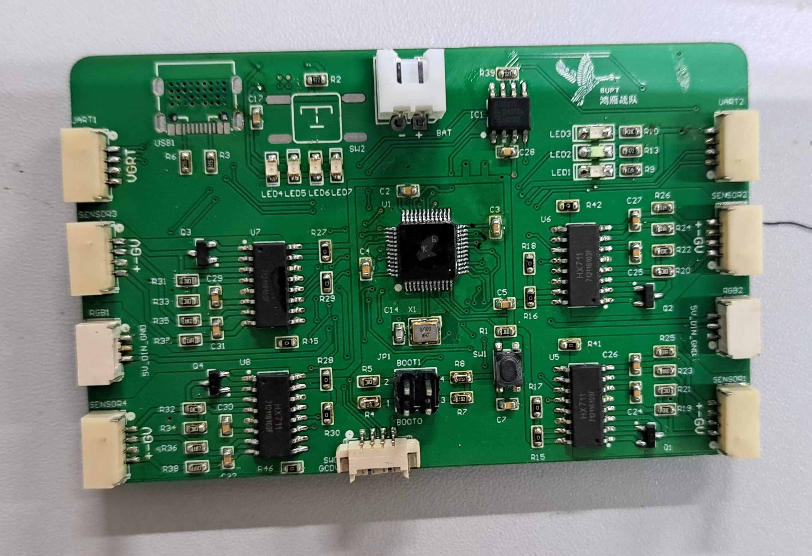
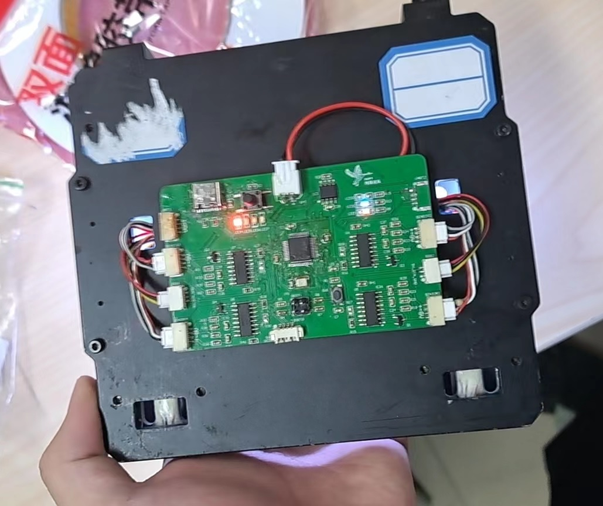
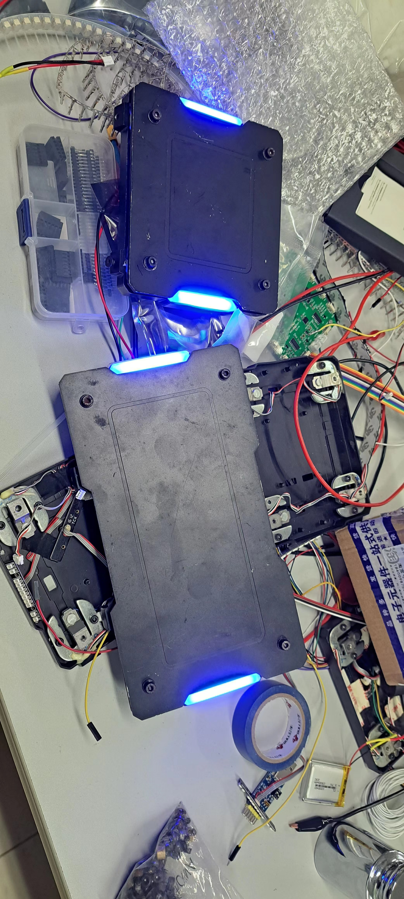

# armor-plate
Robomaster手持装甲板
  

## 前言
通过回收Robomaster往届的废旧装甲板实现，由于需要触发电源开关，最后方案是将PCB粘在装甲板的背后，电池则放在装甲板里面。

## 功能
1. 检测弹丸击打
2. 锂电池充电电路(IP5306)：可实现循环再用
3. 可串联：装甲板之间可进行通信，供电
4. 装甲板即是按键：通过按压装甲板模拟按键效果、有消抖功能
5. 装甲板id冲突检测：相同id装甲板串联时，装甲板亮白灯
6. 可切换颜色：匀力按压装甲板3秒后放开，可切换不同颜色
7. 可设置id：匀力按压装甲板超过8秒，进入设置id模式，按一下闪烁一下代表id=id+1。重启或20秒后会自动退出设置id模式。电路板上的LED在正常模式下闪烁次数为装甲板id
8. 可保存装甲板信息：上次开启时的装甲板颜色、装甲板id

## 效果
  

